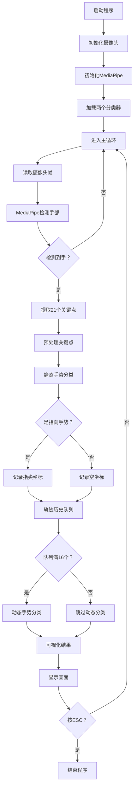
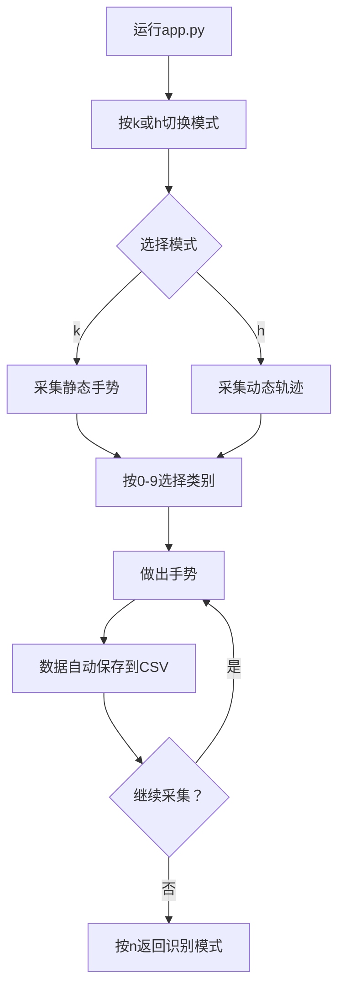

# 手势识别系统技术文档

基于 MediaPipe 和深度学习的实时手势识别项目


---

## 📋 目录

1. [项目概述](#项目概述)
2. [系统架构](#系统架构)
3. [技术栈](#技术栈)
4. [核心文件说明](#核心文件说明)
5. [工作流程](#工作流程)
6. [模型详解](#模型详解)
7. [数据流程](#数据流程)
8. [使用指南](#使用指南)
9. [模型训练](#模型训练)
10. [手势类别](#手势类别)
11. [性能优化](#性能优化)

---

## 🎯 项目概述

本项目实现了一个实时手势识别系统，能够识别**静态手势**（手的形状）和**动态手势**（手指运动轨迹）。

### 核心功能

- ✅ **静态手势识别**：识别手的形状（张开、握拳、指向等）
- ✅ **动态手势识别**：识别手指移动轨迹（顺时针、逆时针、停止、不同方向移动等）
- ✅ **实时处理**：基于摄像头的实时识别
- ✅ **训练数据采集**：可以实时采集新的训练样本
- ✅ **轻量级模型**：使用 TensorFlow Lite 量化模型，推理速度快

---

## 🏗️ 系统架构

以下架构图展示了整个系统的数据流和处理流程：

```
┌─────────────────────────────────────────────────────────────┐
│                       摄像头输入                              │
└───────────────────────┬─────────────────────────────────────┘
                        │
                        ▼
┌─────────────────────────────────────────────────────────────┐
│              MediaPipe Hands 检测                            │
│            (检测手部位置和21个关键点)                           │
└────────────────────┬────────────────────────────────────────┘
                     │
                     ├──────────────────┬─────────────────────┐
                     ▼                  ▼                     ▼
            ┌──────────────┐   ┌──────────────┐    ┌──────────────┐
            │  关键点坐标    │   │  指尖坐标     │    │  关键点预处理  │
            │  (21个点)     │   │  (索引指尖)   │    │  (归一化)     │
            └──────┬───────┘   └──────┬───────┘    └──────┬───────┘
                   │                  │                   │
                   ▼                  ▼                   │
          ┌──────────────┐   ┌──────────────┐             │
          │ 静态手势分类器  │  │轨迹历史队列     │            │
          │ (MLP模型)     │   │ (16个时间步)  │            │
          └──────┬───────┘   └──────┬───────┘            │
                 │                  │                    │
                 │                  ▼                    │
                 │          ┌──────────────┐             │
                 │          │动态手势分类器   │            │
                 │          │(MLP/LSTM)    │             │
                 │          └──────┬───────┘             │
                 │                 │                     │
                 └────────┬────────┴────────────────────┘
                          │
                          ▼
                 ┌──────────────────┐
                 │   结果可视化显示   │
                 │ (手势类别+轨迹线)  │
                 └──────────────────┘
```

---

## 💻 技术栈

| 技术 | 版本 | 用途 |
|------|------|------|
| **Python** | 3.8+ | 编程语言 |
| **MediaPipe** | 0.10.21 | 手部关键点检测 |
| **TensorFlow** | 2.17.0 | 深度学习模型训练 |
| **OpenCV** | 4.10.0.84 | 图像处理和可视化 |
| **scikit-learn** | 1.5.2 | 数据划分和模型评估 |
| **NumPy** | - | 数值计算 |
| **Matplotlib** | 3.9.2 | 绘图和可视化 |

---

## 📁 核心文件说明

### 1. **app.py** - 主程序

**作用**：实时手势识别的主应用程序

**核心功能**：
- 摄像头初始化和图像采集
- 调用 MediaPipe 进行手部检测
- 调用两个分类器进行手势识别
- 实时可视化显示结果
- 支持训练数据采集模式

**关键函数**：

| 函数名 | 功能 | 输入 | 输出 |
|--------|------|------|------|
| `main()` | 主循环 | 无 | 无 |
| `get_args()` | 解析命令行参数 | 命令行参数 | args对象 |
| `calc_landmark_list()` | 提取21个关键点坐标 | 图像, MediaPipe结果 | 关键点列表 |
| `pre_process_landmark()` | 预处理关键点（归一化） | 关键点列表 | 归一化后的列表 |
| `pre_process_point_history()` | 预处理轨迹历史 | 图像, 轨迹队列 | 归一化后的轨迹 |
| `logging_csv()` | 保存训练数据到CSV | 模式, 数据 | 无 |
| `draw_landmarks()` | 绘制手部骨架 | 图像, 关键点 | 绘制后的图像 |

**操作模式**：

```python
# 运行模式切换（按键控制）
Mode 0 (按n键): 正常识别模式
Mode 1 (按k键): 采集静态手势数据（按0-9选择类别）
Mode 2 (按h键): 采集动态轨迹数据（按0-9选择类别）
```

**手部关键点索引**：

MediaPipe 检测到的21个关键点及其预处理流程：


```
索引说明：
0-1: 手腕
2-4: 大拇指
5-8: 食指
9-12: 中指
13-16: 无名指
17-20: 小指
```

---

### 2. **model/keypoint_classifier/keypoint_classifier.py** - 静态手势分类器

**作用**：基于手部21个关键点进行静态手势分类

**类说明**：

```python
class KeyPointClassifier(object):
    """
    静态手势分类器
    
    输入：42维向量（21个关键点 × 2个坐标）
    输出：手势类别编号（0, 1, 2, ...）
    
    模型：TensorFlow Lite 量化模型
    默认模型路径：model/keypoint_classifier/static_gesture_model/avazahedi/keypoint_classifier.tflite
    """
    
    def __init__(self, model_path, num_threads=1):
        """
        初始化分类器
        - 加载 TFLite 模型
        - 分配张量缓冲区
        """
    
    def __call__(self, landmark_list):
        """
        执行推理
        - 输入：预处理后的关键点坐标
        - 返回：预测的类别编号
        """
```

**数据处理流程**：

```
原始关键点 (21个点，每个点(x,y))
    ↓
转换为相对坐标（相对于手腕点）
    ↓
归一化（除以最大值）
    ↓
展平为42维向量
    ↓
输入到模型
    ↓
Softmax输出概率分布
    ↓
Argmax得到类别编号
```

---

### 3. **model/point_history_classifier/point_history_classifier.py** - 动态手势分类器

**作用**：基于指尖移动轨迹进行动态手势分类

**类说明**：

```python
class PointHistoryClassifier(object):
    """
    动态手势分类器
    
    输入：32维向量（16个时间步 × 2个坐标）
    输出：轨迹类别编号
    
    特点：支持置信度阈值过滤
    默认模型路径：model/point_history_classifier/dynamic_gesture_model/NUM_CLASSES_7/point_history_classifier.tflite
    """
    
    def __init__(self, model_path, score_th=0.5, invalid_value=0, num_threads=1):
        """
        初始化分类器
        - 加载 TFLite 模型
        - 设置置信度阈值
        """
    
    def __call__(self, point_history):
        """
        执行推理
        - 输入：预处理后的轨迹序列
        - 返回：预测的类别编号（低置信度返回invalid_value）
        """
```

**轨迹处理流程**：

```
实时采集指尖坐标（当检测到"指向"手势时）
    ↓
存入固定长度队列（16个时间步）
    ↓
转换为相对坐标（相对于第一个点）
    ↓
归一化（除以图像尺寸）
    ↓
展平为32维向量
    ↓
输入到模型
    ↓
Softmax输出概率分布
    ↓
检查置信度阈值
    ↓
返回类别编号
```

---

### 4. **keypoint_classification.ipynb** - 静态手势模型训练

**作用**：训练静态手势分类模型

**训练流程**：

```python
# 1. 导入库和设置
import tensorflow as tf
from sklearn.model_selection import train_test_split

# 2. 加载训练数据
# CSV格式：[标签, x1, y1, x2, y2, ..., x21, y21]
X_dataset = np.loadtxt('model/keypoint_classifier/keypoint.csv', ...)
y_dataset = np.loadtxt(...)

# 3. 划分训练集和测试集（75%:25%）
X_train, X_test, y_train, y_test = train_test_split(...)

# 4. 构建模型（全连接神经网络）
model = tf.keras.models.Sequential([
    Input(42,),           # 输入层：42维
    Dropout(0.2),         # 防止过拟合
    Dense(20, relu),      # 隐藏层1：20个神经元
    Dropout(0.4),
    Dense(10, relu),      # 隐藏层2：10个神经元
    Dense(NUM_CLASSES, softmax)  # 输出层
])

# 5. 编译模型
model.compile(
    optimizer='adam',
    loss='sparse_categorical_crossentropy',
    metrics=['accuracy']
)

# 6. 训练模型
model.fit(
    X_train, y_train,
    epochs=1000,
    batch_size=128,
    validation_data=(X_test, y_test),
    callbacks=[ModelCheckpoint, EarlyStopping]
)

# 7. 转换为 TFLite 格式（量化）
converter = tf.lite.TFLiteConverter.from_keras_model(model)
converter.optimizations = [tf.lite.Optimize.DEFAULT]
tflite_model = converter.convert()
```

**模型结构**：


```
Layer (type)                Output Shape              Param #
=================================================================
Input                       (None, 42)                0
Dropout (0.2)               (None, 42)                0
Dense (20, ReLU)            (None, 20)                860
Dropout (0.4)               (None, 20)                0
Dense (10, ReLU)            (None, 10)                210
Dense (NUM_CLASSES, Softmax)(None, NUM_CLASSES)       33 (NUM_CLASSES=3)
=================================================================
Total params: 1,103
```

**输入特征**：

- 21个关键点的x,y坐标
- 预处理：相对坐标 + 归一化
- 最终输入：42维向量

**网络结构**：

```
Input(42) 
  ↓
Dropout(0.2) ──→ 防止过拟合
  ↓
Dense(20, ReLU) ──→ 第一层特征提取
  ↓
Dropout(0.4) ──→ 更强的正则化
  ↓
Dense(10, ReLU) ──→ 第二层特征提取
  ↓
Dense(3, Softmax) ──→ 输出概率分布
```

**输出**：

- 3个类别的概率分布
- 例如：[0.1, 0.2, 0.7] 表示第2类概率最高

**评估方法**：

1. **准确率（Accuracy）**：分类正确的比例
2. **混淆矩阵（Confusion Matrix）**：展示各类别的分类情况
3. **分类报告（Classification Report）**：
   - Precision（精确率）
   - Recall（召回率）
   - F1-score

---

### 5. **point_history_classification.ipynb** - 动态手势模型训练

**作用**：训练动态手势分类模型

**训练流程**：

```python
# 1. 设置参数
TIME_STEPS = 16  # 时间步长
DIMENSION = 2    # 坐标维度
NUM_CLASSES = 4  # 类别数量

# 2. 加载训练数据
# CSV格式：[标签, x1, y1, x2, y2, ..., x16, y16]
X_dataset = np.loadtxt('model/point_history_classifier/point_history.csv', ...)
y_dataset = np.loadtxt(...)

# 3. 构建模型（两种选择）
use_lstm = False  # 是否使用LSTM

if use_lstm:
    # LSTM模型（适合时序数据）
    model = Sequential([
        Reshape((TIME_STEPS, DIMENSION)),
        LSTM(16),
        Dense(10, relu),
        Dense(NUM_CLASSES, softmax)
    ])
else:
    # 全连接模型（更快）
    model = Sequential([
        Dense(24, relu),
        Dense(10, relu),
        Dense(NUM_CLASSES, softmax)
    ])

# 4. 训练和转换为TFLite（同静态手势）
```

**模型结构图**：

MLP模型（推荐）：


LSTM模型（可选）：


**模型对比**：(**推荐**：使用 MLP 模型，速度更快且准确率足够)

| 模型类型 | 参数量 | 推理速度 | 准确率 |
|---------|--------|---------|--------|
| MLP（全连接） | ~1000 | 快 | 较高 |
| LSTM | ~3000 | 较慢 | 更高 |

**输入特征**：

- 16个时间步的指尖坐标（仅在"指向"手势时记录）
- 预处理：相对坐标 + 归一化
- 最终输入：32维向量

**网络结构（MLP版本）**：

```
Input(32) 
  ↓
Dropout(0.2)
  ↓
Dense(24, ReLU) ──→ 时序特征提取
  ↓
Dropout(0.5)
  ↓
Dense(10, ReLU)
  ↓
Dense(4, Softmax) ──→ 输出4个类别的概率
```

**输出**：

- 4个类别的概率分布
- 置信度阈值：score_th = 0.5
- 低于阈值返回类别0（Stop）

---

### 6. **utils/cvfpscalc.py** - FPS计算工具

**作用**：计算和显示实时帧率

```python
class CvFpsCalc(object):
    """
    FPS（帧率）计算器
    
    使用滑动窗口平均多帧时间，得到平滑的FPS值
    """
    
    def __init__(self, buffer_len=1):
        """buffer_len: 平滑窗口大小"""
        
    def get(self):
        """返回当前FPS"""
```

---

### 7. **配置文件**

#### **静态手势标签文件**

**路径**：`model/keypoint_classifier/static_gesture_model/[model_name]/keypoint_classifier_label.csv`

**格式**：每行一个类别名称，行号对应类别编号（从0开始）

**说明**：定义静态手势的类别名称，用于显示识别结果。

#### **动态手势标签文件**

**路径**：`model/point_history_classifier/dynamic_gesture_model/[model_name]/point_history_classifier_label.csv`

**格式**：每行一个类别名称，行号对应类别编号（从0开始）

**说明**：定义动态手势的类别名称，用于显示识别结果。不同模型可能有不同数量的类别（如4类、7类等）。

#### **模型文件**

**静态手势模型**：
- Keras 模型：`keypoint_classifier.keras` 或 `keypoint_classifier.hdf5` （训练阶段使用）
- TFLite 模型：`keypoint_classifier.tflite` （推理阶段使用）

**动态手势模型**：
- Keras 模型：`point_history_classifier.keras` （训练阶段使用）
- TFLite 模型：`point_history_classifier.tflite` （推理阶段使用）

**说明**：TFLite模型是量化后的轻量级模型，体积小、速度快，适合实时推理。

---

## 🔄 工作流程

### 实时识别流程

以下流程图展示了系统从启动到实时识别的完整工作流程：

> **提示**：如果您的Markdown编辑器不支持Mermaid图表渲染，可以使用在线工具（如 [Mermaid Live Editor](https://mermaid.live/)）查看。



### 数据采集流程

以下流程图展示了如何采集训练数据：



---


---

## 📊 数据流程

### 1. 关键点数据流

```
原始图像 (640x480)
    ↓
MediaPipe检测
    ↓
21个关键点 [(x1,y1), (x2,y2), ..., (x21,y21)]
    ↓
转换为相对坐标（以手腕为基准）
    ↓
展平为列表 [x1,y1,x2,y2,...,x21,y21]
    ↓
归一化（除以最大绝对值）
    ↓
42维归一化向量 [-1~1之间]
    ↓
输入到静态手势分类器
    ↓
输出类别编号
```

### 2. 轨迹数据流

```
指尖坐标 (x, y)
    ↓
添加到双端队列（maxlen=16）
    ↓
队列满时触发处理
    ↓
转换为相对坐标（相对于第一个点）
    ↓
归一化（除以图像尺寸）
    ↓
展平为32维向量
    ↓
输入到动态手势分类器
    ↓
输出类别编号（带置信度过滤）
```

### 3. CSV数据格式

**静态手势数据**：
- **路径**：`model/keypoint_classifier/static_gesture_model/[model_name]/keypoint.csv`
- **格式**：每行包含 [类别编号, x1, y1, x2, y2, ..., x21, y21]（共43列）
- **说明**：存储21个关键点的归一化坐标

**动态轨迹数据**：
- **路径**：`model/point_history_classifier/dynamic_gesture_model/[model_name]/point_history.csv`
- **格式**：每行包含 [类别编号, x1, y1, x2, y2, ..., x16, y16]（共33列）
- **说明**：存储16个时间步的指尖归一化坐标

---

## 🚀 使用指南

### 环境配置

**安装依赖**：

```bash
pip install -r requirements.txt
```

---

### 基本使用

#### 1. 运行实时识别

```bash
# 使用默认摄像头（设备0）
python app.py

# 指定摄像头设备
python app.py --device 1

# 自定义分辨率
python app.py --width 1280 --height 720

# 调整检测灵敏度
python app.py --min_detection_confidence 0.8 --min_tracking_confidence 0.7
```

**命令行参数**：

| 参数 | 说明 | 默认值 |
|------|------|--------|
| `--device` | 摄像头设备编号 | 0 |
| `--width` | 图像宽度 | 960 |
| `--height` | 图像高度 | 540 |
| `--use_static_image_mode` | 静态图像模式（不跟踪） | False |
| `--min_detection_confidence` | 检测置信度阈值 | 0.7 |
| `--min_tracking_confidence` | 跟踪置信度阈值 | 0.5 |

---

#### 2. 采集训练数据

**采集静态手势数据**：


```
1. 运行 python app.py
2. 按 'k' 键进入静态手势采集模式（显示「MODE:Logging Key Point」）
3. 按 '0'-'9' 选择手势类别
4. 做出手势后，按对应数字键保存数据（按键保存的是之前的手势）
5. 数据自动保存到对应模型目录的 CSV 文件
6. 按 'n' 返回正常模式
```

数据格式示例（CSV文件）：


典型手势示例：

  

*从左到右：张开手 (Open)、握拳 (Close)、指向 (Pointer)*

**采集动态轨迹数据**：


```
1. 运行 python app.py
2. 按 'h' 键进入轨迹采集模式（显示「MODE:Logging Point History」）
3. 按 '0'-'9' 选择轨迹类别
4. 做"指向"手势并移动，完成后按对应数字键保存（按键保存的是之前的轨迹）
5. 数据自动保存到对应模型目录的 CSV 文件
6. 按 'n' 返回正常模式
```

轨迹数据格式示例（CSV文件）：


典型动态手势示例：

   

*从左到右：静止 (Stop)、顺时针 (Clockwise)、逆时针 (Counter Clockwise)、移动 (Move)*

**数据采集技巧**：
- 每个类别采集 500-1000 个样本
- 从不同角度、不同光照条件采集
- 保持手在摄像头视野内
- 动作要自然流畅

---

#### 3. 训练模型

**训练静态手势模型**：

```bash
# 在 Jupyter Notebook 中打开
jupyter notebook keypoint_classification.ipynb

# 或使用 VSCode 打开 .ipynb 文件

# 按顺序执行所有单元格：
# 1. 导入库
# 2. 加载数据
# 3. 构建模型
# 4. 训练模型
# 5. 评估模型
# 6. 转换为 TFLite
```

**训练动态轨迹模型**：

```bash
# 打开 point_history_classification.ipynb
# 执行流程同上

# 注意：可选择 LSTM 或 MLP 模型
use_lstm = False  # MLP更快，推荐
use_lstm = True   # LSTM更准，但慢
```

**训练参数调整**：

```python
# 在 notebook 中可以调整的参数

# 训练轮数（早停机制会自动停止）
epochs = 1000

# 批次大小（根据显存调整）
batch_size = 128

# 早停耐心值（连续N个epoch不提升则停止）
patience = 20

# Dropout比例（防止过拟合）
dropout_rate = 0.4

# 学习率优化器
optimizer = 'adam'  # 推荐
# optimizer = 'sgd'  # 传统方法
```

---

#### 4. 添加新手势

**步骤**：

1. **修改类别数量**：

```python
# 在 keypoint_classification.ipynb 中
NUM_CLASSES = 4  # 从3改为4（添加一个新类别）
```

2. **更新标签文件**：

```csv
# model/keypoint_classifier/keypoint_classifier_label.csv
Open
Close
Pointer
NewGesture  # 添加新类别名称
```

3. **采集数据**：

```
运行 app.py
按 'k' 进入采集模式
按 '3' 选择新类别（编号从0开始）
做出新手势并采集数据
```

4. **重新训练模型**：

```
打开 keypoint_classification.ipynb
执行所有单元格
生成新的 .tflite 文件
```

5. **测试新手势**：

```
运行 app.py
做出新手势，查看识别结果
```

---

## 📚 模型训练

### 训练数据要求

**静态手势**：
- 每个类别：500-1000个样本
- 总样本数：1500-3000（3个类别）
- 数据分布：训练集75%，测试集25%

**动态轨迹**：
- 每个类别：300-500个样本
- 总样本数：1200-2000（4个类别）
- 采集要求：完整的16帧轨迹

---

### 训练技巧

1. **数据增强**（可选）：

```python
# 在 notebook 中添加数据增强
from tensorflow.keras.layers import RandomRotation, RandomFlip

# 添加到模型开头
data_augmentation = tf.keras.Sequential([
    RandomRotation(0.1),  # 旋转±10%
])
```

2. **调整模型结构**：

```python
# 增加模型容量（如果数据量大）
model = Sequential([
    Dense(40, activation='relu'),  # 增加到40个神经元
    Dropout(0.3),
    Dense(20, activation='relu'),
    Dropout(0.3),
    Dense(NUM_CLASSES, activation='softmax')
])
```

3. **学习率调整**：

```python
# 使用学习率衰减
from tensorflow.keras.callbacks import ReduceLROnPlateau

lr_callback = ReduceLROnPlateau(
    monitor='val_loss',
    factor=0.5,
    patience=5,
    min_lr=1e-6
)

model.fit(..., callbacks=[..., lr_callback])
```

---

### 模型评估指标

**关注指标**：

1. **准确率（Accuracy）**：
   - 训练集：>95%
   - 验证集：>90%

2. **损失值（Loss）**：
   - 训练集和验证集曲线应该接近
   - 验证集损失不应持续上升（过拟合）

3. **混淆矩阵**：
   - 对角线值应该高（正确分类）
   - 非对角线值应该低（错误分类）

4. **各类别指标**：
   - Precision（精确率）: >0.85
   - Recall（召回率）: >0.85
   - F1-score: >0.85

---

## 🏷️ 手势类别

### 静态手势

**类别数量**：根据不同的模型而定（通常为3-10类）

**类别定义**：在标签文件中定义（`keypoint_classifier_label.csv`）

**典型类别示例**：
- 基本手势：张开、握拳、指向等
- 数字手势：1、2、3、4、5等
- 字母手势：A、B、C等（手语字母）

---

### 动态轨迹

**类别数量**：根据不同的模型而定（如4类、7类等）

**类别定义**：在标签文件中定义（`point_history_classifier_label.csv`）

**典型类别示例**：
- 基础轨迹：停止、顺时针、逆时针等
- 方向轨迹：上、下、左、右等
- 复杂轨迹：画圈、画线、Z字形等

**说明**：动态手势通常需要先识别出"指向"手势，然后跟踪指尖移动轨迹进行分类。

---

## ⚡ 性能优化

### 1. 提高FPS

**方法**：

```python
# 降低分辨率
python app.py --width 640 --height 480

# 减少MediaPipe检测数量
max_num_hands=1  # 只检测一只手

# 使用静态图像模式（不跟踪）
python app.py --use_static_image_mode
```

---

### 2. 提高准确率

**方法**：

```python
# 提高检测置信度阈值
python app.py --min_detection_confidence 0.8

# 增加训练数据量
# 使用数据增强
# 调整模型结构
```

---

### 3. 减少误识别

**方法**：

```python
# 提高动态手势的置信度阈值
# 在 point_history_classifier.py 中修改
score_th=0.7  # 从0.5提高到0.7

# 增加轨迹历史长度
history_length = 24  # 从16增加到24

# 使用投票机制
finger_gesture_history = deque(maxlen=history_length)
most_common_fg_id = Counter(finger_gesture_history).most_common()
```

---

## 🐛 常见问题

### 问题1：摄像头无法打开

**解决方案**：

```bash
# 尝试不同的设备编号
python app.py --device 0
python app.py --device 1
python app.py --device 2

# 检查摄像头权限
# Windows: 设置 -> 隐私 -> 相机
# Mac: 系统偏好设置 -> 安全性与隐私 -> 相机
# Linux: 检查 /dev/video* 设备
```

---

### 问题2：检测不到手

**解决方案**：

```python
# 降低检测阈值
python app.py --min_detection_confidence 0.5

# 改善光照条件
# 确保手在摄像头视野内
# 背景简洁，避免复杂纹理
```

---

### 问题3：识别不准确

**解决方案**：

```python
# 1. 增加训练数据
# 2. 重新训练模型
# 3. 调整模型参数
# 4. 使用数据增强
```

---

### 问题4：FPS过低

**解决方案**：

```python
# 1. 降低分辨率
python app.py --width 640 --height 480

# 2. 使用GPU加速（如果有独立显卡）
# 安装 tensorflow-gpu

# 3. 减少检测手数量
max_num_hands=1
```

---

## 📖 参考资料

- **MediaPipe Hands**: https://google.github.io/mediapipe/solutions/hands.html
- **TensorFlow Lite**: https://www.tensorflow.org/lite
- **OpenCV**: https://opencv.org/

---

## 📝 总结

本项目实现了一个完整的实时手势识别系统，包含：

✅ **双模型识别**：静态手势 + 动态轨迹
✅ **完整流程**：数据采集 → 模型训练 → 实时识别
✅ **轻量级部署**：TFLite量化模型，适合边缘设备
✅ **可扩展性**：易于添加新手势类别

**核心技术点**：
- MediaPipe 手部关键点检测
- TensorFlow 深度学习模型
- TFLite 模型量化和部署
- 实时视频流处理


